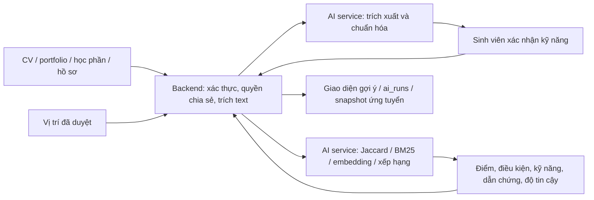

# Kế hoạch hoàn thành AI service cho InternLink

**Ngày lập:** 30/09/2026  
**Phạm vi:** mô-đun trích xuất kỹ năng, chuẩn hóa và xếp hạng vị trí thực tập.  
**Tài liệu đầu vào:** `mo_ta_luan_van.txt`, `docs/ARCHITECTURE_DESIGN.md`, `docs/PROJECT_BASELINE_ONE_MONTH.md`, mã hiện tại trong `ai-service/` và hợp đồng gọi từ `backend-core/`.

## 1. Kết quả cần đạt

Sinh viên cung cấp CV, portfolio, học phần, kỹ năng tự khai và nguyện vọng. Doanh nghiệp cung cấp mô tả vị trí, kỹ năng bắt buộc/mong muốn, địa điểm, hình thức và thời gian. Hệ thống trả về danh sách **vị trí đã được duyệt** theo thứ tự ưu tiên; mỗi kết quả có kỹ năng khớp/thiếu, điều kiện chưa thỏa, lý do có dẫn chứng và mức tin cậy của dữ liệu. Sinh viên xác nhận hoặc sửa kỹ năng được trích xuất và tự quyết định ứng tuyển. AI không tự động loại hồ sơ.

**MVP bắt buộc:** taxonomy kỹ năng có phiên bản; trích xuất và xác nhận kỹ năng; ba phương pháp so sánh Jaccard, BM25, embedding; xếp hạng lai có điều kiện nghiệp vụ; giải thích; tập nhãn chuyên gia và báo cáo đánh giá tái lập được. Các chức năng dự báo bỏ thực tập và tóm tắt nhật ký thuộc giai đoạn sau.

## 2. Hiện trạng mã và khoảng cách

| Thành phần | Đã có | Cần hoàn thành |
| --- | --- | --- |
| Trích xuất | `POST /api/v1/skills/extract`; LLM hoặc dò alias; sinh viên xác nhận kỹ năng trong backend | Dẫn chứng chính xác trong văn bản, chống nhận diện sai do phủ định/ngữ cảnh, độ tin cậy có nghĩa rõ, xử lý CV/portfolio/học phần theo từng nguồn |
| Taxonomy | Danh mục cục bộ `SK-*`; migration `V6` đồng bộ một phần với backend | Một nguồn dữ liệu chuẩn có phiên bản, ánh xạ tùy chọn đến URI ESCO/O*NET, bí danh tiếng Việt theo ngành; không gọi các mã `SK-*` là mã ESCO |
| Ranking | Điểm 55% kỹ năng + 35% ngữ nghĩa + 10% học lực; trả kỹ năng khớp/thiếu | Jaccard và BM25 thực chạy; địa điểm/thời gian/hình thức; phân biệt thiếu dữ liệu với không thỏa; lý do theo từng kỹ năng; mức tin cậy riêng với điểm phù hợp |
| Embedding | Gọi Gemini hoặc sinh vector giả theo hash | Thay mô hình đã ngừng, bỏ vector giả khỏi luồng chấm điểm, lưu phiên bản/dimension, fallback minh bạch sang phương pháp từ vựng |
| Đánh giá | Endpoint demo dùng nhãn và điểm dựng sẵn | Tập cặp hồ sơ-vị trí có nhãn chuyên gia; chạy cùng dữ liệu qua các thuật toán thật; nDCG/Precision/Recall/MRR, phân tích lỗi và ablation |
| Tích hợp | Backend gọi AI service theo từng vị trí, có fallback kỹ năng; `ai_runs` hiện chủ yếu ghi CV | Hợp đồng API thống nhất, gọi theo lô, log phiên bản và kết quả đối sánh, snapshot tại lúc ứng tuyển, giới hạn lỗi/timeout |

**Các vấn đề có thể gây kết quả sai ngay:** `gemini-1.5-flash` (trích xuất) và `text-embedding-004` trong `ai-service/app/config.py` đã ngừng hoạt động; vector dự phòng trong `embedding_service.py` là ngẫu nhiên theo hash văn bản, không biểu diễn ngữ nghĩa. Ngoài ra, `ranking_service.py` cho `semantic_score = 0.5` khi thiếu embedding và mặc định GPA = 3.0 dù backend không truyền GPA. Những giá trị này không nên được trình bày như đo lường thực tế.

## 3. Kiến trúc mục tiêu và ranh giới trách nhiệm



- **Backend** giữ dữ liệu nghiệp vụ, quyền truy cập, lọc trạng thái vị trí/kỳ thực tập, quyết định ràng buộc bắt buộc do trường quy định, lưu log/snapshot và trả dữ liệu cho giao diện. AI service không ghi trực tiếp database nghiệp vụ.
- **AI service** nhận dữ liệu tối thiểu cần thiết, trả kết quả có phiên bản thuật toán/taxonomy/mô hình; không cần tên, email, giới tính hoặc điểm số không liên quan.
- **Một nguồn taxonomy:** tạo tệp hoặc bảng quản trị chuẩn, từ đó sinh bản dùng cho Python và migration/đồng bộ backend. Mã nội bộ `SK-*` giữ ổn định; `external_ref` là URI/mã ESCO hoặc O*NET nếu đối chiếu được. Không tự gán nguồn ESCO cho từ điển tự biên soạn.

## 4. Quy trình triển khai theo thứ tự phụ thuộc

### Giai đoạn 0 — Chốt dữ liệu và hợp đồng (2–3 ngày)

1. Liệt kê các trường đang có trong `StudentProfile`, `JobPosition`, `JobSkill`, `InternshipTerm`; phân loại **đã có / cần bổ sung / chưa được thu thập**. Hiện job có `location`, `workFormat`, kỳ có ngày bắt đầu/kết thúc; sở thích địa điểm/lịch rảnh của sinh viên chưa thấy trong luồng gọi AI.
2. Chốt quy chế thực tập với khoa: ngành/kỳ/trạng thái nào là điều kiện tham gia bắt buộc; thiếu kỹ năng bắt buộc có phải chỉ là cảnh báo hay điều kiện cứng; cách xử lý vị trí từ xa và lịch không rõ. Quy tắc này phải được duyệt theo quy chế trường, không suy từ mô hình.
3. Chốt schema API v2 và mapping backend trước khi đổi thuật toán. Ghi rõ `score` thang 0–100 là **điểm xếp hạng**, không phải xác suất được nhận; `confidence` chỉ phản ánh chất lượng bằng chứng/độ đầy đủ đầu vào.
4. Chốt chính sách dữ liệu: có quyền dùng CV để tính gợi ý và gửi đến nhà cung cấp mô hình hay không; thời gian lưu văn bản và hash; ai xem được nguồn bằng chứng. Dùng hồ sơ giả lập hoặc khử định danh khi đánh giá luận văn.

**Xong khi:** có bảng ánh xạ trường backend ↔ AI API, quy tắc ràng buộc và tập ví dụ request/response được kiểm tra chung.

### Giai đoạn 1 — Taxonomy và trích xuất có dẫn chứng (4–6 ngày)

1. Rà soát danh mục IT hiện tại với giảng viên/ngành đào tạo; thêm alias tiếng Việt, viết tắt và kỹ năng từ học phần. Gắn `id`, `canonical_name`, `aliases`, `category`, `source`, `external_ref`, `taxonomy_version`, `status`. Chọn mô hình trích xuất còn hoạt động hoặc dùng luật cục bộ; xác thực cấu hình trước khi gọi API thật.
2. Ưu tiên exact alias có ranh giới từ phù hợp với `C#`, `C++`, `.NET`, `Go`; fuzzy chỉ đưa ra **ứng viên cần xác nhận**. Tách ví dụ dùng công nghệ khỏi tên gọi chung, câu phủ định, yêu cầu trong JD và kỹ năng thực sự có trong CV.
3. Trích xuất từ từng nguồn theo cấu trúc `{skill_id, surface_form, source_type, source_id, span_start, span_end, evidence_text, extraction_method, confidence_band, confirmed}`. Học phần chỉ tạo bằng chứng nếu đã hoàn thành; tự khai phải phân biệt với minh chứng từ CV/portfolio.
4. Kiểm thử thủ công một tập đoạn ngắn tiếng Việt/Anh có viết tắt, phủ định, bảng CV và công nghệ dễ nhầm. Sinh viên xác nhận/sửa/từ chối; thao tác sửa được lưu để cải thiện alias.

**Xong khi:** không đưa kỹ năng AI chưa xác nhận vào ranking chính; mỗi kỹ năng được dùng để giải thích có nguồn xác định hoặc được sinh viên tự xác nhận; taxonomy Python/backend không lệch ID.

### Giai đoạn 2 — Baseline đo được (3–4 ngày)

1. **Jaccard:** áp dụng trên tập `skill_id` chuẩn hóa. Ghi rõ cách xử lý hai tập rỗng: `unknown`, không xem là phù hợp tuyệt đối.
2. **BM25:** lập chỉ mục mô tả vị trí đã duyệt gồm tiêu đề, kỹ năng, nhiệm vụ; truy vấn từ hồ sơ đã xác nhận. Tokenizer phải thử trên tiếng Việt, tiếng Anh, ký hiệu công nghệ và alias; không chỉ tách theo khoảng trắng. Chỉ số BM25 chuẩn hóa trong **cùng một tập vị trí ứng viên**, không xem điểm thô là phần trăm.
3. Cố định cách xây tập ứng viên và thứ tự ổn định khi hòa điểm để cả ba phương pháp được so sánh trên cùng một tập.

**Xong khi:** cùng một bộ input tạo cùng thứ tự và điểm baseline; có kết quả Jaccard/BM25 thực tế, không dùng điểm mẫu gán sẵn.

### Giai đoạn 3 — Embedding và xếp hạng lai (4–6 ngày)

1. Thay `google-generativeai` bằng SDK `google-genai` nếu tiếp tục dùng Gemini; chọn mô hình trích xuất và embedding còn hoạt động, xác nhận dimension/task mode trên tài khoản triển khai. Một nhánh thay thế là embedding đa ngôn ngữ chạy cục bộ có hỗ trợ tiếng Việt. Quyết định theo kết quả trên tập nhãn, chi phí và giới hạn chia sẻ CV.
2. Chỉ so sánh vector cùng `model_id`, `dimension`, tiền xử lý và tác vụ; cache theo hash nội dung + phiên bản. Nếu embedding lỗi/không có khóa, đánh dấu `semantic_unavailable` và chuyển sang baseline từ vựng. Không trả vector ngẫu nhiên hoặc tự đặt `semantic_score = 0.5`.
3. Áp dụng quy tắc nghiệp vụ trước khi sắp hạng: chỉ vị trí đã duyệt, đúng kỳ, còn mở; điều kiện không tương thích chắc chắn được báo rõ. Trường còn thiếu dữ liệu có trạng thái `unknown`, không suy thành `pass` hoặc `fail`.
4. Công thức ban đầu để **thử nghiệm**, giữ 55% kỹ năng + 35% ngữ nghĩa + 10% điều kiện/nguyện vọng trên các trường thực có. Không dùng GPA giả định. Kỹ năng bắt buộc/mong muốn tính riêng; thiếu kỹ năng bắt buộc là `gap` được giải thích, trừ khi quy chế trường xác định là điều kiện loại. Hiệu chỉnh trọng số bằng tập phát triển, khóa công thức trước khi đo trên tập kiểm thử.
5. Tạo câu giải thích từ dữ liệu có cấu trúc: tên kỹ năng chuẩn, yêu cầu bắt buộc/mong muốn, minh chứng của sinh viên, điều kiện địa điểm/thời gian. Không để LLM tự sáng tác lý do. Điểm ngữ nghĩa chỉ bổ trợ xếp hạng, không được biến thành kỹ năng khớp.

**Xong khi:** ranking có thể chạy cả khi nhà cung cấp embedding ngừng hoạt động; giao diện thấy vì sao vị trí đứng cao, thiếu gì và dữ liệu nào chưa đủ; cùng input + phiên bản tạo cùng kết quả.

### Giai đoạn 4 — Tích hợp backend, log và an toàn vận hành (3–5 ngày)

1. Backend lọc và gửi **một lô** vị trí cho `rank-jobs`, thay cho mỗi vị trí một lời gọi. Gửi trường đã chuẩn hóa, không gửi PII không cần thiết. Xác thực lời gọi nội bộ, giới hạn kích thước batch/văn bản, timeout và cấu hình CORS phù hợp môi trường.
2. Đồng bộ response mới vào `AiMatchScoreResponse` mà vẫn giữ trường cũ trong giai đoạn chuyển tiếp. Bổ sung `matched_skills`, `missing_skills`, `constraint_status`, `evidence`, `confidence`, `algorithm_version`, `taxonomy_version`, `model_version`, `fallback_mode`.
3. Ghi `ai_runs` cho ranking theo metadata, input hash/phiên bản và kết quả đủ để kiểm toán; khi ứng tuyển lưu `ai_match_detail` snapshot. Không lưu toàn văn CV trong log. Log rõ trường hợp fallback và lỗi dịch vụ.
4. Thử end-to-end với hồ sơ không có CV, CV lỗi, chưa xác nhận kỹ năng, vị trí thiếu mô tả, embedding lỗi, điều kiện địa điểm/thời gian chưa biết, cùng nhiều vị trí một lúc.

**Xong khi:** màn hình gợi ý trả danh sách ổn định, không rỗng âm thầm khi một vị trí lỗi; admin thấy lượt ranking và chế độ fallback; snapshot ứng tuyển khớp điều sinh viên đã xem.

### Giai đoạn 5 — Đánh giá luận văn và chốt MVP (4–6 ngày)

1. Lấy bộ vị trí từ đối tác hoặc nguồn được phép dùng; tạo hồ sơ giả lập/khử định danh có độ đa dạng về ngành, kỹ năng, địa điểm và thời gian. Đóng băng taxonomy, tập ứng viên và phiên bản thuật toán trước khi đánh giá.
2. Tạo biểu mẫu cho ít nhất **2 người chấm** mỗi cặp hồ sơ-vị trí theo mức 0 = không phù hợp, 1 = có thể cân nhắc, 2 = phù hợp; lưu nhận xét và trường hợp bất đồng. Quy mô khởi đầu khả thi: 20–30 hồ sơ × 8–12 vị trí ứng viên có kiểm soát, sau đó chốt theo thời gian của giảng viên. Đây là mục tiêu thu thập, chưa phải dữ liệu đã có.
3. Tách tập phát triển và tập kiểm thử theo hồ sơ, tránh cùng một CV xuất hiện ở hai tập. Chọn trọng số/ngưỡng trên tập phát triển; chỉ báo cáo kết quả cuối trên tập kiểm thử.
4. So sánh Jaccard, BM25, embedding, kỹ năng + embedding, và hybrid + điều kiện. Báo cáo nDCG@5/@10, Precision@5, Recall@5, MRR, độ đồng thuận người chấm, số trường hợp không có gợi ý hợp lệ; thêm bootstrap CI nếu số truy vấn đủ. Báo cáo cả latency, tỷ lệ fallback, chi phí/API nếu dùng model ngoài.
5. Phân tích ít nhất 20 lỗi điển hình: alias sai, kỹ năng suy diễn, tiếng Việt/Anh, CV ít thông tin, vị trí mơ hồ, thiếu ràng buộc. Kiểm tra phân bố thứ hạng theo nhóm *đủ dữ liệu và được phép đánh giá*; không dùng thuộc tính nhạy cảm làm đặc trưng xếp hạng.

**Xong khi:** có script chạy đánh giá từ dữ liệu đóng băng, bảng kết quả tái lập được, ví dụ giải thích đúng/sai và nhận xét chuyên gia. Không tuyên bố hybrid tốt hơn nếu chênh lệch không được dữ liệu ủng hộ.

## 5. Hợp đồng kết quả đề xuất

```json
{
  "job_id": "uuid",
  "rank_score": 78.4,
  "score_label": "điểm ưu tiên, không phải xác suất trúng tuyển",
  "components": {"skill": 0.82, "semantic": 0.74, "preference": 0.70},
  "constraint_status": "eligible",
  "constraint_reasons": [],
  "matched_skills": [
    {"id": "SK-JAVA", "name": "Java", "requirement": "mandatory", "evidence": {"source_type": "cv", "source_id": "uuid", "excerpt": "Dự án Java Spring Boot"}}
  ],
  "missing_skills": [
    {"id": "SK-DOCKER", "name": "Docker", "requirement": "optional"}
  ],
  "data_confidence": "medium",
  "confidence_reasons": ["1 kỹ năng xác nhận; chưa có lịch rảnh"],
  "fallback_mode": "none",
  "versions": {"algorithm": "hybrid-v1", "taxonomy": "internlink-it-v2", "embedding": "configured-model-id"}
}
```

`data_confidence` nên là `low/medium/high` theo quy tắc công khai như tỷ lệ kỹ năng có xác nhận/minh chứng, độ đầy đủ của JD và số trường ràng buộc đã biết. Nếu muốn gọi là xác suất, phải có nhãn kết quả phù hợp và kiểm định hiệu chuẩn riêng; MVP không cần điều đó.

## 6. Lịch gợi ý và điểm kiểm tra

Ước lượng **20–30 ngày làm việc** cho một người đã quen codebase, cộng thời gian chờ người chấm dữ liệu. Có thể xếp trong 4–6 tuần nếu phần đánh giá được chuẩn bị song song; không mặc định đủ trong một tháng khi chưa có nhãn chuyên gia.

| Mốc | Sản phẩm kiểm tra | Điều kiện qua mốc |
| --- | --- | --- |
| Cuối tuần 1 | Schema, taxonomy v2, bộ ca trích xuất | ID thống nhất, kỹ năng có nguồn, quy tắc nghiệp vụ được duyệt |
| Cuối tuần 2 | Jaccard, BM25, extraction có dẫn chứng | Baseline chạy trên dữ liệu thật; sinh viên sửa/xác nhận được |
| Cuối tuần 3 | Embedding mới, hybrid, fallback | Không còn vector giả; giải thích và điều kiện hoạt động |
| Cuối tuần 4 | Tích hợp batch và log | Luồng gợi ý → ứng tuyển có snapshot; chạy thử các ca lỗi |
| Tuần 5–6 | Báo cáo đánh giá và phân tích lỗi | So sánh trên tập nhãn đóng băng; có giới hạn kết luận rõ ràng |

## 7. Việc mở rộng sau MVP

1. **Portfolio/GitHub:** chỉ phân tích repository do sinh viên liên kết và cho phép; trích từ README, manifest và mô tả dự án, tách kỹ năng có minh chứng với từ khóa xuất hiện ngẫu nhiên.
2. **Kiểm tra chất lượng JD:** quy tắc phát hiện thiếu nhiệm vụ, chuẩn đầu ra, người hướng dẫn, thời lượng, kỹ năng không cụ thể; yêu cầu người duyệt xác nhận thay vì tự từ chối vị trí.
3. **Kế hoạch học tập:** đề xuất học phần/tài nguyên từ `missing_skills` đã chuẩn hóa và mục tiêu học tập của trường; luôn liên kết đến nguồn học phần.
4. **Tóm tắt nhật ký:** chỉ sau khi dữ liệu nhật ký/đánh giá có quyền truy cập và ID minh chứng ổn định; mọi câu tóm tắt liên kết về bản ghi gốc.
5. **Cảnh báo ngừng thực tập:** chỉ nghiên cứu sau khi có dữ liệu quy trình đủ chất lượng và quy trình hỗ trợ riêng tư; đánh giá lỗi, sai lệch nhóm và tác động trước khi sử dụng. Không hiển thị nhãn tiêu cực công khai.
6. **Learning-to-rank:** chỉ cân nhắc khi có click/apply/accept đủ lớn, đã xử lý thiên lệch vị trí hiển thị và selection bias; không dùng các sự kiện này như nhãn phù hợp trực tiếp.

## 8. Nguồn đối chiếu

- [ESCO Download và phiên bản dữ liệu](https://esco.ec.europa.eu/en/use-esco/download): dữ liệu có thể tải nhiều định dạng/ngôn ngữ; cần tự xây ánh xạ tiếng Việt và kiểm tra điều kiện sử dụng bản phát hành.
- [ESCO Web Service API](https://esco.ec.europa.eu/en/use-esco/use-esco-services-api/esco-web-service-api): định danh kỹ năng/nghề bằng URI.
- [O*NET Database](https://www.onetcenter.org/database.html): kỹ năng và công nghệ theo nghề, có bản CSV/JSON và điều kiện ghi công nguồn.
- [Gemini model deprecations](https://ai.google.dev/gemini-api/docs/deprecations) và [release notes](https://ai.google.dev/gemini-api/docs/changelog): `text-embedding-004` đã ngừng 14/01/2026; `gemini-1.5-flash` đã ngừng 29/09/2025. Kiểm tra model đang dùng trước triển khai.
- [Google GenAI SDK](https://ai.google.dev/gemini-api/docs/libraries) và [Embedding API](https://ai.google.dev/gemini-api/docs/embeddings): SDK hiện hành và cấu hình embedding.
- [Sentence Transformers multilingual models](https://sbert.net/docs/sentence_transformer/pretrained_models.html): phương án embedding cục bộ có tiếng Việt cần được đo trên chính tập dữ liệu của luận văn.
- [scikit-learn nDCG](https://scikit-learn.org/stable/modules/generated/sklearn.metrics.ndcg_score.html): định nghĩa nDCG để kiểm tra script đánh giá.
