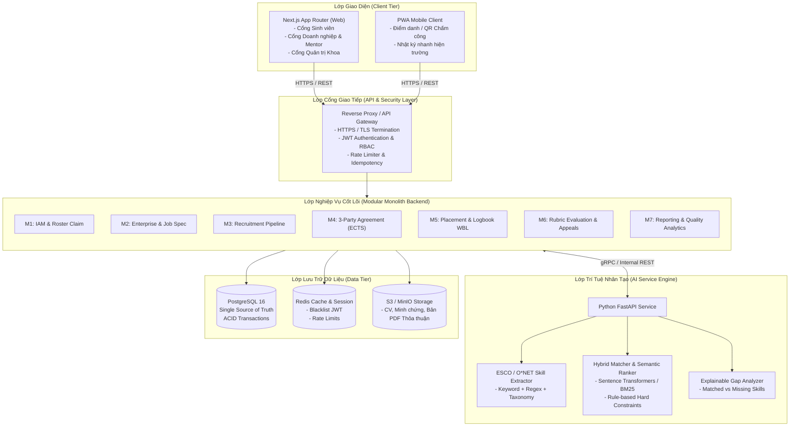
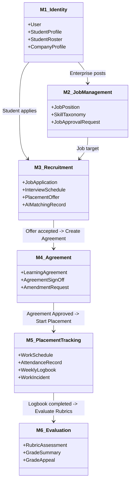
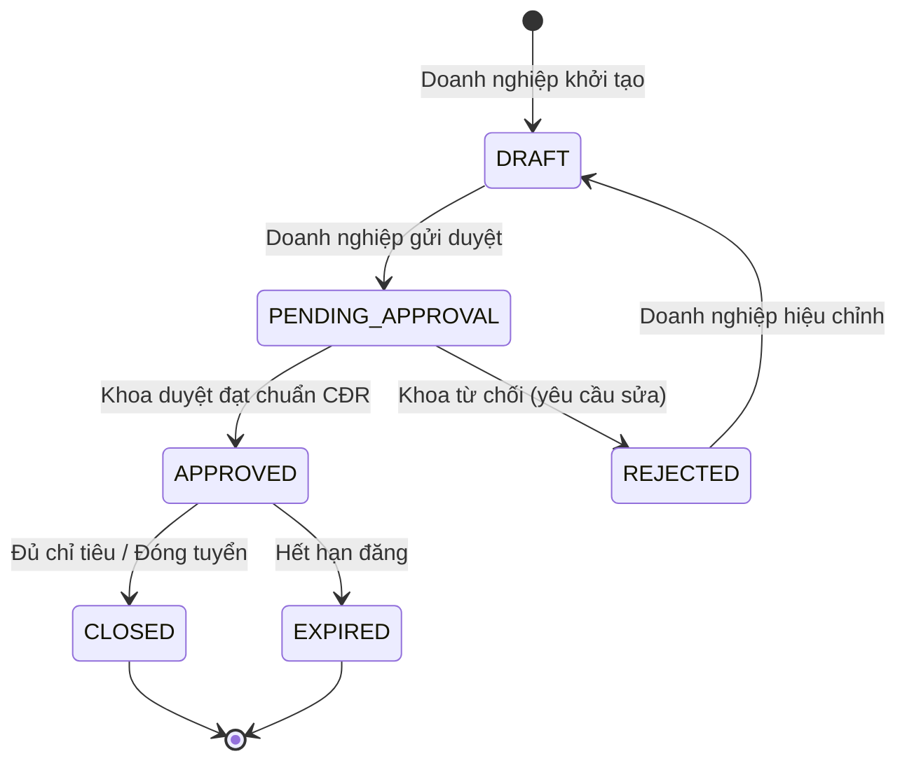
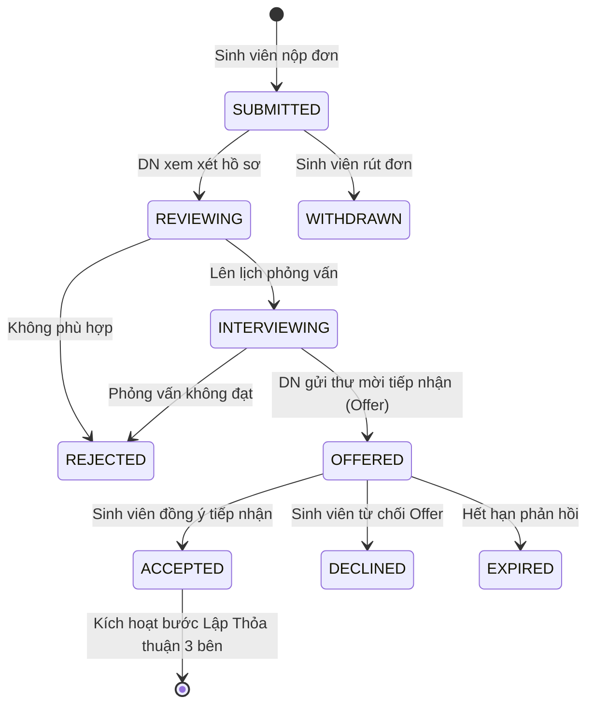
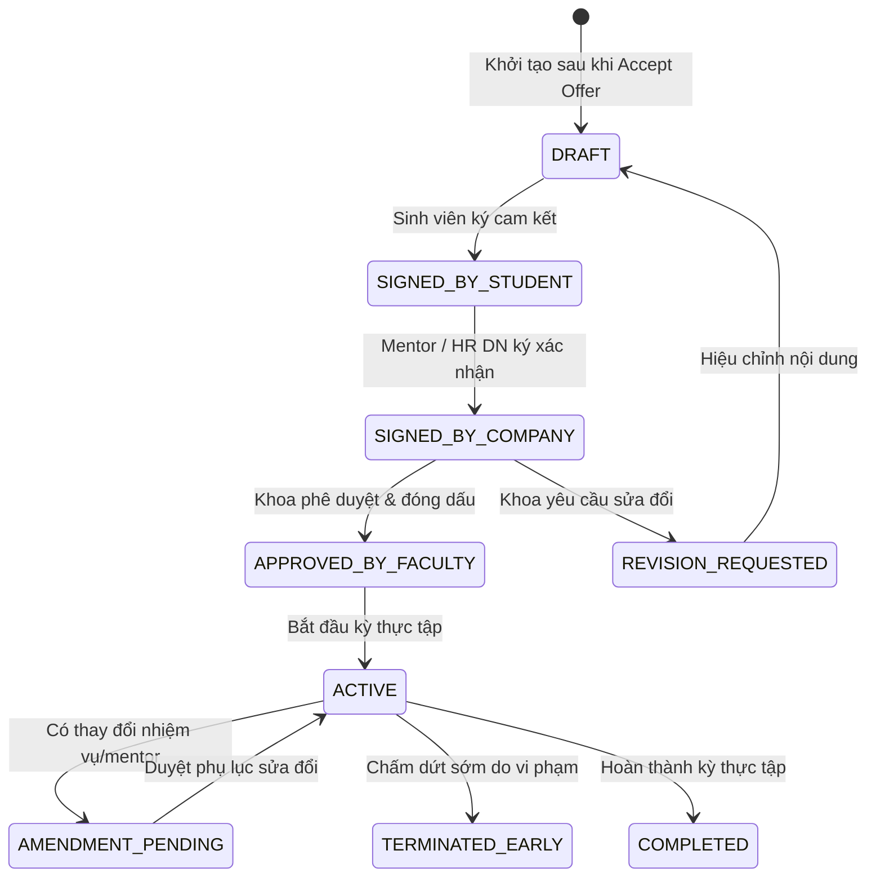
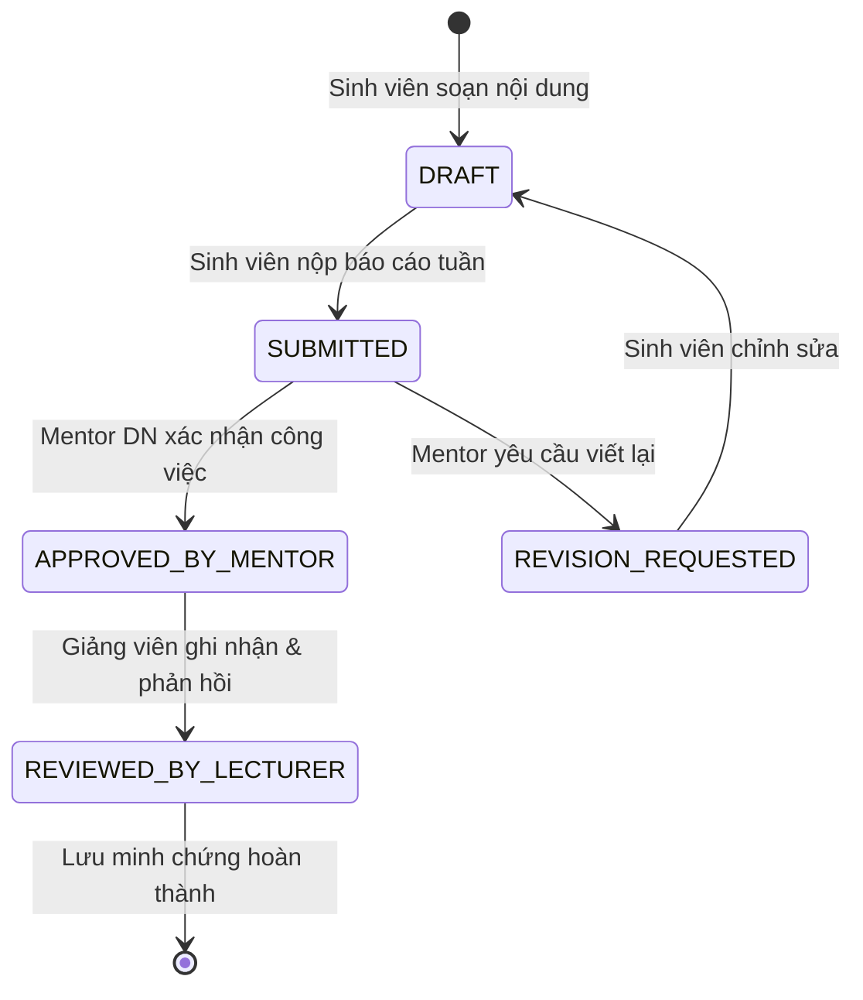
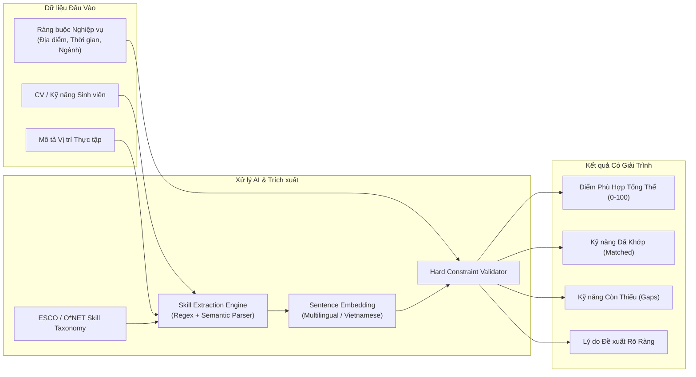

# INTERNLINK SYSTEM ARCHITECTURE DESIGN
## Nền tảng Quản trị Toàn trình Thực tập Doanh nghiệp & Đối sánh Năng lực Tích hợp AI
**Chuẩn tham chiếu học thuật & nghề nghiệp**: Erasmus+ Traineeship, ILO Rec. 208, QAA WBL, NACE Career Readiness

---

## 1. TỔNG QUAN & NGUYÊN TẮC THIẾT KẾ KIẾN TRÚC (ARCHITECTURAL PRINCIPLES)

### 1.1. Bối cảnh & Vấn đề cần giải quyết
Hệ thống quản lý thực tập truyền thống thường gặp các vấn đề:
1. **Phình to thiếu kiểm soát (System Bloat)**: Quá nhiều bảng dữ liệu thừa, vi dịch vụ phân mảnh, trạng thái giả lập (fake status), điểm số AI không giải thích được.
2. **Thiếu tính kết nối 3 bên**: Không có cơ chế ràng buộc trách nhiệm pháp lý - đào tạo giữa **Nhà trường (Khoa/Giảng viên) - Sinh viên - Doanh nghiệp (Mentor/HR)**.
3. **Mất kiểm soát tiến độ & chất lượng**: Chấm công lỏng lẻo, nhật ký thực tập đối phó, đánh giá cảm tính không theo chuẩn năng lực (Competency Rubric).

### 1.2. Các nguyên tắc cốt lõi (Core Principles)
* **Lean Modular Monolith First**: Thiết kế kiến trúc dạng đơn khối phân mô-đun (Modular Monolith) với ranh giới nghiệp vụ (Bounded Contexts) tường minh. Dễ triển khai, dễ kiểm soát, không phân tán phức tạp.
* **Strict State Machine (Không trạng thái ảo)**: Mọi sự chuyển đổi trạng thái thực thể (Job, Application, Offer, Agreement, Logbook, Evaluation) đều phải thông qua Command API có kiểm tra điều kiện tiên quyết (Invariants) và ghi nhận Audit Trail.
* **Explainable AI (AI có giải trình)**: Mô hình AI không đưa ra con số phần trăm mù mờ; mọi kết quả đối sánh (Matching) phải giải thích rõ: **Kỹ năng đã khớp (Matched Skills)**, **Khoảng trống kỹ năng (Skill Gaps)**, và **Lý do đề xuất (Evidence-based Explanation)**.
* **Chuẩn hóa Học thuật Quốc tế**:
  * **Erasmus+ Learning Agreement**: Thỏa thuận đào tạo 3 bên có phiên bản và chữ ký điện tử.
  * **NACE Career Readiness Framework**: Bộ 8 năng lực cốt lõi làm thang đo Rubric đánh giá.
  * **QAA / ILO**: Quy trình giám sát an toàn lao động, xử lý ngoại lệ và giải quyết khiếu nại (Appeals).

---

## 2. KIẾN TRÚC TỔNG THỂ HỆ THỐNG (SYSTEM TOPOLOGY)

---

## 3. PHÂN ĐỊNH 6 PHÂN HỆ NGHIỆP VỤ (BOUNDED CONTEXTS)

### M1: Phân hệ Xác thực & Định danh (IAM & Roster Claim)
* **Trách nhiệm**: Quản lý tài khoản, phân quyền dựa trên vai trò (RBAC), xác thực danh sách sinh viên chính quy được Khoa phê duyệt (Roster Verification / Claim).
* **Vai trò người dùng (Roles)**:
  1. `STUDENT`: Sinh viên thực tập.
  2. `COMPANY_REP`: Đại diện Doanh nghiệp (HR, Giám đốc).
  3. `COMPANY_MENTOR`: Người hướng dẫn trực tiếp tại Doanh nghiệp.
  4. `LECTURER`: Giảng viên hướng dẫn học thuật từ phía Trường.
  5. `FACULTY_ADMIN`: Ban Quản lý Thực tập Khoa / Trưởng Bộ môn.
  6. `ADMIN`: Quản trị viên kỹ thuật hệ thống.

### M2: Phân hệ Doanh nghiệp & Vị trí Thực tập (Enterprise & Job Specification)
* **Trách nhiệm**: Đăng ký và thẩm định tư cách đối tác tiếp nhận, đăng tuyển vị trí thực tập, trích xuất chuẩn đầu ra và thẩm định tính phù hợp theo chương trình đào tạo của Khoa.
* **Quy chuẩn**: QAA Work-Based Learning & ILO Rec. 208.

### M3: Phân hệ AI Đối sánh & Tuyển dụng (AI Matching & Recruitment Pipeline)
* **Trách nhiệm**:
  * Trích xuất kỹ năng từ CV và hồ sơ sinh viên đối sánh với mô tả vị trí (Job Spec).
  * Xếp hạng gợi ý có giải trình (Explainable Match Scoring).
  * Quản lý vòng nộp đơn, lịch phỏng vấn, gửi Offer chính thức và ghi nhận quyết định đồng ý/từ chối của sinh viên.

### M4: Phân hệ Thỏa thuận 3 Bên (Learning Agreement & Compliance)
* **Trách nhiệm**: Chuẩn hóa thỏa thuận thực tập 3 bên theo chuẩn **Erasmus+ Learning Agreement for Traineeships**:
  * Mục tiêu học tập, chuẩn đầu ra học phần (ECTS Credits).
  * Chương trình đào tạo và nhiệm vụ cụ thể tại nơi làm việc.
  * Ký số 3 bên: Sinh viên $\rightarrow$ Doanh nghiệp $\rightarrow$ Khoa duyệt chính thức.
  * Quản lý phụ lục điều chỉnh (Amendments) trong quá trình thực tập.

### M5: Phân hệ Theo dõi Thực tập, Chấm công & Nhật ký (Placement & Logbook WBL)
* **Trách nhiệm**:
  * Chấm công theo ca (Onsite/Hybrid/Remote) kèm định vị GPS / QR Code.
  * Nhật ký học tập hàng tuần (Weekly Reflective Journals) gắn với chuẩn kỹ năng NACE.
  * Cơ chế phê duyệt 2 lớp: Mentor Doanh nghiệp xác nhận thực tế $\rightarrow$ Giảng viên hướng dẫn nhận xét học thuật.
  * Xử lý sự cố (Incidents, vắng phép, làm bù, xin đổi đơn vị thực tập).

### M6: Phân hệ Đánh giá Rubric, Điểm số & Phúc khảo (Rubric Evaluation & Appeals)
* **Trách nhiệm**:
  * Phiếu đánh giá Rubric giữa kỳ và cuối kỳ chuẩn hóa theo 8 nhóm năng lực NACE.
  * Tổng hợp điểm trọng số (Mentor DN: 40%, Giảng viên: 40%, Báo cáo/Nhật ký: 20%).
  * Quy trình khiếu nại & phúc khảo minh bạch (Appeals Committee).
  * Đối chiếu chuẩn đầu ra và thống kê khoảng thiếu năng lực thực tế.

---

## 4. MÔ HÌNH MÁY TRẠNG THÁI CHUẨN NGHIỆP VỤ (STATE MACHINES)

### 4.1. Vị trí Tuyển dụng (Job Position Lifecycle)

### 4.2. Hồ sơ Ứng tuyển & Tuyển chọn (Application & Offer Lifecycle)

### 4.3. Thỏa thuận Thực tập 3 Bên (Learning Agreement Lifecycle)

### 4.4. Nhật ký Thực tập Tuần (Weekly Logbook Lifecycle)

---

## 5. MÔ HÌNH DỮ LIỆU TINH GỌN (LEAN DATABASE SCHEMA)

Hệ thống được thiết kế tinh gọn gồm **14 bảng lõi cốt lõi**, loại bỏ toàn bộ các bảng trung gian thừa thãi:

| STT | Bảng dữ liệu | Bounded Context | Mục đích lưu trữ |
| :--- | :--- | :--- | :--- |
| 1 | `users` | M1: IAM | Tài khoản người dùng, email, mật khẩu băm, vai trò (Role), trạng thái |
| 2 | `student_rosters` | M1: IAM | Danh sách sinh viên đủ điều kiện làm thực tập do Khoa import |
| 3 | `student_profiles` | M1: IAM | Hồ sơ cá nhân, CV, liên kết GitHub/Portfolio, danh sách kỹ năng tự khai |
| 4 | `company_profiles` | M1: IAM | Thông tin pháp lý, MST, lĩnh vực, người đại diện, trạng thái xác minh |
| 5 | `skill_taxonomies` | M2: Job Spec | Từ điển kỹ năng chuẩn hóa (ESCO / O*NET / Khung CTU) |
| 6 | `job_positions` | M2: Job Spec | Vị trí thực tập, mô tả, yêu cầu kỹ năng, chỉ tiêu, trạng thái kiểm duyệt |
| 7 | `job_applications` | M3: Recruitment | Đơn ứng tuyển của sinh viên vào vị trí, trạng thái quy trình tuyển |
| 8 | `placement_offers` | M3: Recruitment | Đề nghị tiếp nhận thực tập chính thức kèm quyền lợi, hạn phản hồi |
| 9 | `learning_agreements` | M4: Agreement | Hợp đồng 3 bên chuẩn Erasmus+, mục tiêu CĐR, ECTS, trạng thái chữ ký |
| 10 | `internship_placements`| M5: Placement | Đợt thực tập đang diễn ra của sinh viên, gán Mentor DN & Giảng viên HD |
| 11 | `attendance_logs` | M5: Placement | Dữ liệu chấm công hàng ngày (Check-in/out, GPS, trạng thái Onsite/Remote) |
| 12 | `weekly_logbooks` | M5: Placement | Báo cáo công việc tuần, minh chứng đính kèm, nhận xét 2 bên |
| 13 | `rubric_evaluations` | M6: Evaluation | Điểm đánh giá theo 8 năng lực NACE giữa kỳ & cuối kỳ |
| 14 | `grade_appeals` | M6: Evaluation | Đơn khiếu nại điểm số, kết quả xử lý của Hội đồng phúc khảo Khoa |

---

## 6. KIẾN TRÚC MÔ HÌNH AI (AI MATCHMAKING ENGINE)

* **Quy tắc đạo đức AI (AI Ethics & Non-discrimination)**:
  * AI không bao giờ tự động loại hồ sơ sinh viên.
  * Không sử dụng các thuộc tính nhạy cảm (giới tính, tôn giáo, vùng miền) làm đặc trưng tính toán.
  * Sinh viên luôn có quyền chỉnh sửa danh sách kỹ năng được trích xuất trước khi gửi đi.
